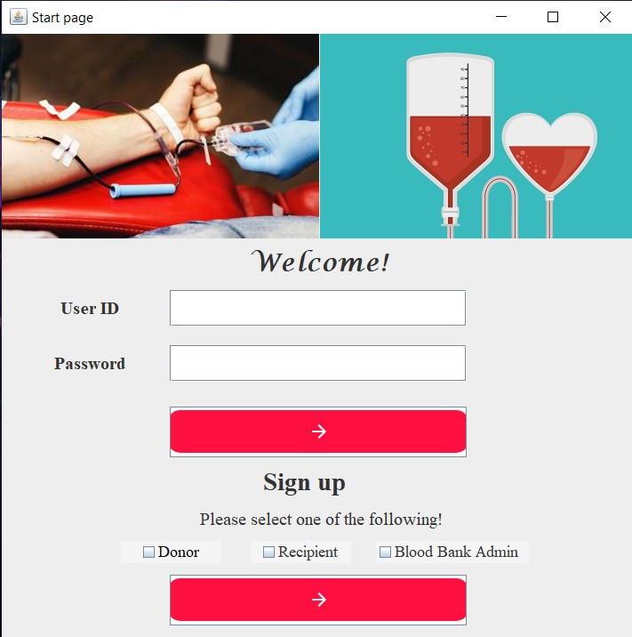
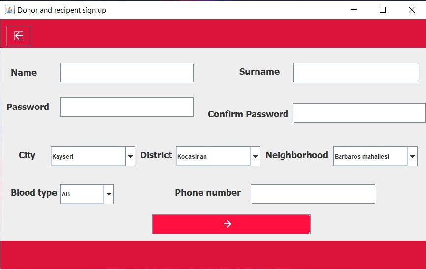
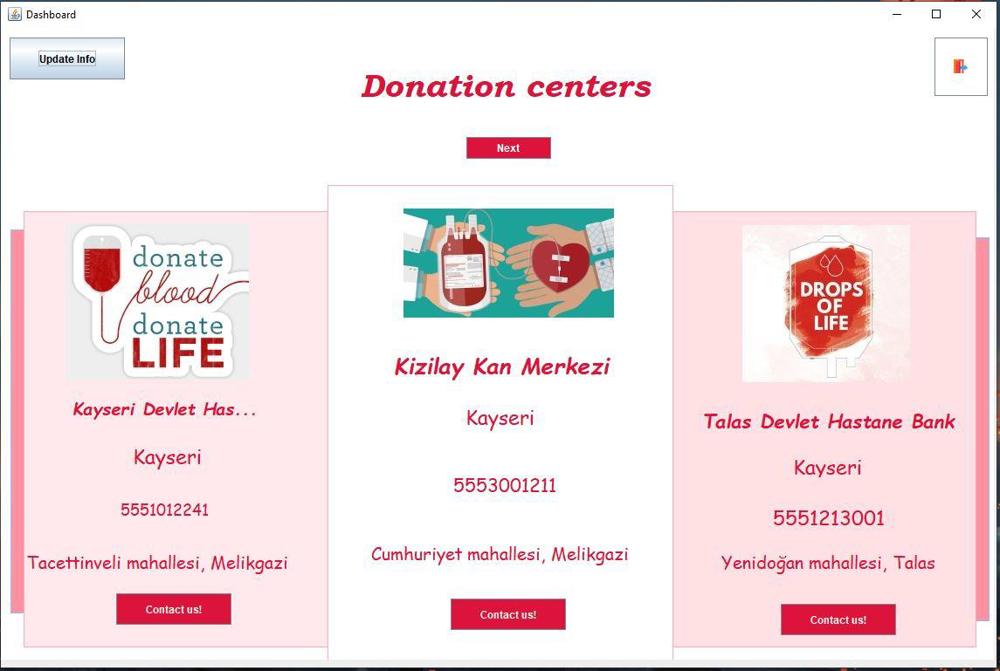
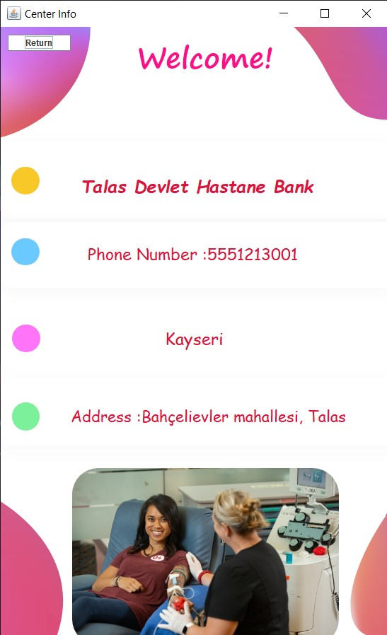
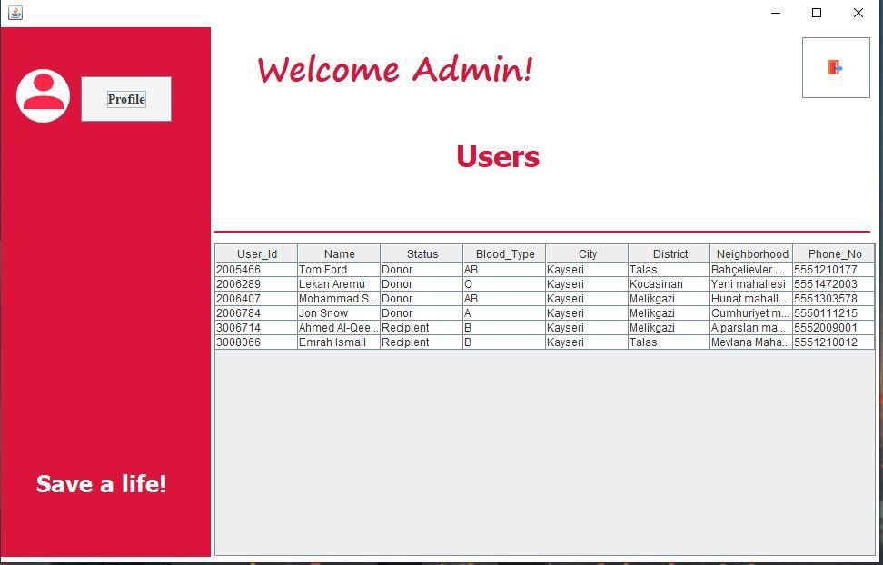
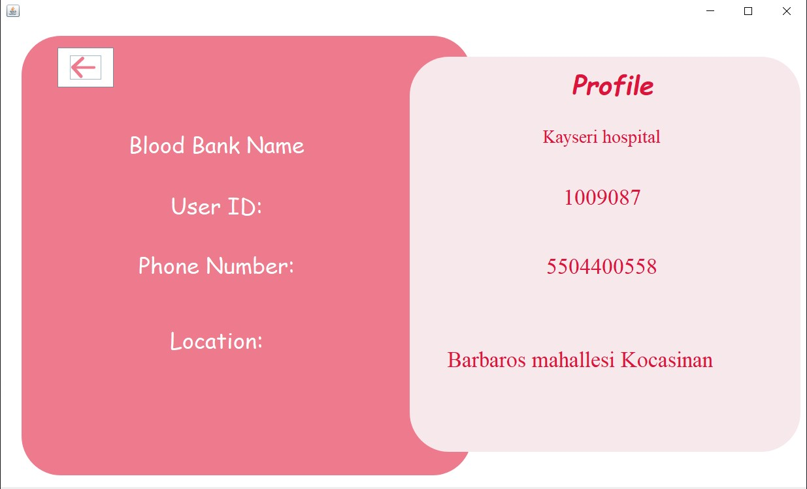

# Blood donation DBMS for COMP204

# Project decription 📃
The objective of this project is to create an optimized and efficient database for blood donations with a modern designed software).
# Dependencies
- [rs2xml](https://sourceforge.net/projects/finalangelsanddemons/)
- [MySQL connection Driver](https://dev.mysql.com/downloads/connector/j/)
# Team members 👨‍💻
- [Ahmed Alqershi](https://github.com/Ahmed-Alqershi)
- [Mohammad Shughri](https://github.com/MXS11)
- [Olamilekan Rasaq AREMU](https://github.com/Areezy)
# Project report 📝
- [Final report](https://drive.google.com/file/d/12fcKsY-g5QpwEGohX-1LEY_gvkocbpoz/view?usp=sharing)
# Project grade 🏁
- 100/100.
# Screenshots 📸

